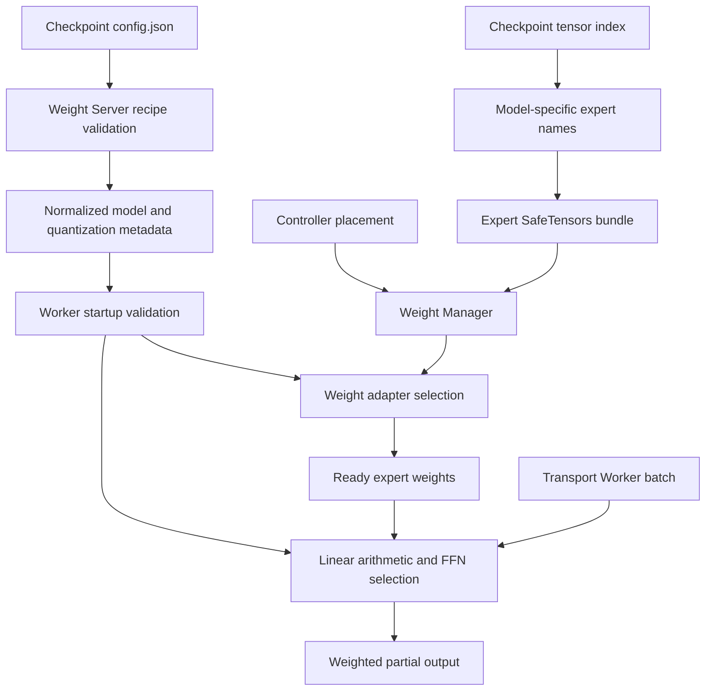
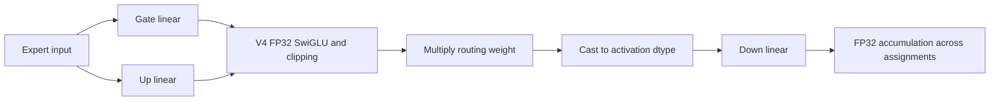
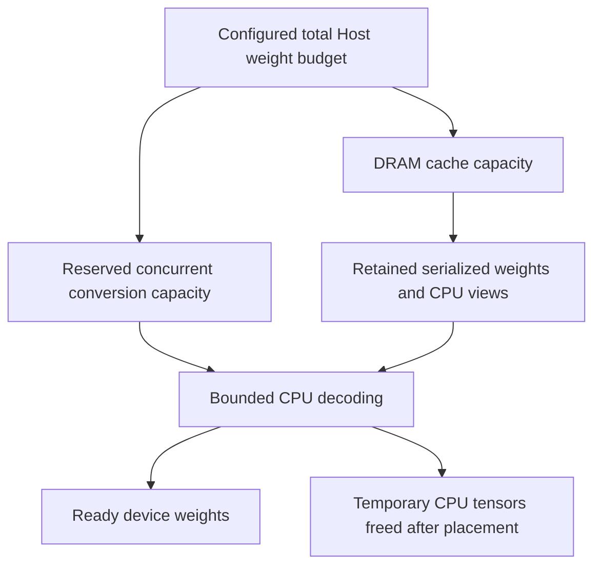

# Quantized expert execution

Expert Kit discovers a checkpoint's expert quantization from the Weight Server,
validates its supported numerical recipe, and selects the Torch weight adapter
and arithmetic at Worker startup. Computation requests use ready weights only.
They never infer the recipe from the presence of a scale tensor or start a load.

## Configuration and ownership

The Weight Server owns checkpoint naming and configuration interpretation. Model
layout determines expert prefixes independently of quantization: V4 uses
`layers.L.ffn.experts.E`, Qwen and earlier DeepSeek layouts use
`model.layers.L.mlp.experts.E`, and Mixtral uses
`model.layers.L.block_sparse_moe.experts.E`. Layout recognition alone does not
qualify an entire checkpoint or its Frontend.

Weight Manager owns fetching, caching, bounded loading, placement and eviction.
The weight adapter validates tensors, creates CPU views, converts representation
and synchronizes placement. The compute backend acquires ready references and
retains them until actual device completion. Transport and Controller do not
interpret quantization formats.

`weight_manager.auto_model_metadata` enables startup discovery.
`weight_manager.metadata_required: true` rejects unavailable discovery, as used
in `examples/deepseek-v4-flash.torch.yaml`. Explicit Worker settings must agree
with the server. Invalid metadata is an error; only unavailable metadata can use
the optional legacy fallback. There is one expert recipe per Worker.

## Fixed supported recipes

| Checkpoint recipe | CPU cache | Ready weights | Linear computation |
| --- | --- | --- | --- |
| Unquantized | Floating source views | Selected floating dtype | Floating GEMM |
| Symmetric AutoGPTQ v1 INT4, canonical groups | Packed words, scales and zero points | Floating weights decoded at placement | Floating GEMM |
| Original DeepSeek-V4-Flash routed experts | Packed E2M1 FP4 and E8M0 scales per 32 values | Floating weights decoded at placement, normally BF16 | E4M3 activation rounding per 128 values followed by floating GEMM |
| Supported compressed-tensors W8A8 export | INT8 source views and per-channel scales | INT8 weights and FP32 scales | Dynamic per-token INT8 quantization, INT32 GEMM accumulation and rescaling |

The selected W8A8 format is `sgl-npu/DeepSeek-V4-Flash-W8A8`, with
`quant_method=compressed-tensors`, `format=int-quantized`, symmetric per-channel
integer weights, and dynamic symmetric per-token integer activations. The Worker
uses `max(abs(x))/127` FP32 activation scales, nearest-even rounding and signed
INT8 clipping. All-zero rows produce zero output. Non-null activation
`scale_dtype`, static activations, nonzero zero points, transforms and unsupported
group strategies are rejected. W8A8 is a fixed supported recipe here, rather than
a promise to execute every export with eight-bit weights and activations.

The original V4 global configuration says FP8 while its routed experts use FP4.
The server resolves those expert-specific semantics before advertising `mxfp4`.
That recipe fixes E2M1 packing, E8M0 scales in groups of 32, and E4M3 activation
rounding with power-of-two scales in groups of 128. The A100 path is a compatibility
implementation; it does not use native FP4 or FP8 GEMM instructions.

## Computation and cross-model reuse

Each linear operation uses the implementation selected at startup: ordinary
floating GEMM, FP8 activation emulation plus floating GEMM, or W8A8. V4 clips the
gate from above and the up projection on both sides according to `swiglu_limit`,
then multiplies routing weights before the down projection. The ordinary SwiGLU
path weights the output after the down projection. These FFN semantics are
selected independently from the linear arithmetic.

Models with the same numerical quantization recipe can reuse the same linear
operator even if their checkpoint parameter names differ. New names belong in
the checkpoint layout handling and weight adapter. New quantization mathematics
requires a corresponding decoder/operator and validation. Different devices may
use different implementations of the same recipe; device kernels stay in the
Worker backend. None of these changes requires quantization-specific Transport
messages or Controller scheduling.

## Host and device memory

Startup reserves `max_concurrent_loads * host_conversion_temporary_bytes()`
from an explicit `weight_manager.dram_cache.max_bytes` budget. The remainder is
the byte-bounded DRAM cache. An insufficient budget fails startup. A null budget
derives enough capacity for the complete expert cache plus conversion capacity.
The reservation is capacity, not eagerly allocated tensor storage. The logical
reserve stays in place while the Worker runs; actual temporary tensors are freed
after conversion. Idle conversion capacity is deliberately not lent to the cache.

The existing load limit covers both reads and conversions, including conversions
whose caller has been cancelled. Reserving capacity before any load avoids a
cycle where every conversion holds a cache entry while waiting for more memory.
The accounting bounds managed tensor storage, not total process RSS or the CPU
allocator's retained arenas.

FP4 decoding expands at most 65,536 values per block. The Host conversion estimate
includes all three decoded matrices and conservative overlapping block temporaries.
For V4 dimensions 4096/2048 in BF16, one expert has 12.75 MiB of packed tensor data,
48 MiB of decoded matrices, and a 52 MiB + 1 KiB Host conversion reservation.
With two concurrent loads, conversion capacity is 104 MiB + 2 KiB. The source
file reservation separately includes the SafeTensors header allowance. GPTQ also
declares its conservative CPU expansion peak through the same adapter interface.

Device capacity is planned separately from Host capacity. FP4 and GPTQ compatibility
paths consume floating ready-weight storage; W8A8 keeps INT8 weights on the device.
Compressed source size must not be used to advertise FP4 ready-expert capacity.

## Qualification and limits

Tests cover strict metadata rejection, model-prefix selection, exact FP4 nibbles
and scales across chunk boundaries, bounded decoding allocations, small Host
budgets, cancellation during concurrent conversion, and numerical/ownership
behavior. Synthetic experts with the published 4096/2048 V4 dimensions qualify
FP4 and W8A8 on the local A100; these are not official checkpoint accuracy or
end-to-end inference benchmarks.

This increment implements expert computation. Full V4 Frontend attention and
hyper-connections, actual-checkpoint numerical qualification, mixed recipes within
one Worker, fused low-bit kernels and Ascend execution remain outside its support.
No checkpoint weight download is required by these tests.
